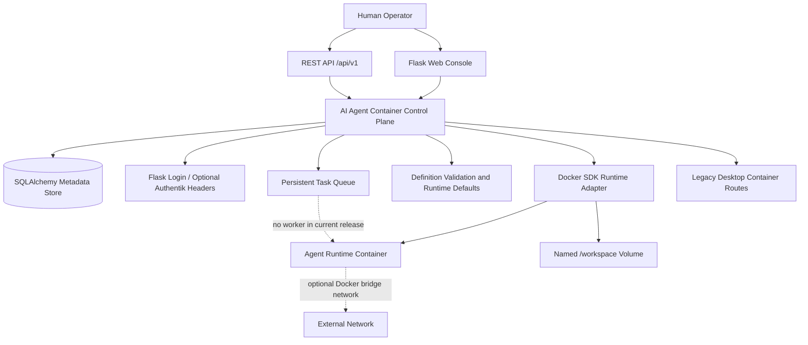

# Architecture

## Current System

The diagram shows the implementation, including the missing task worker. The `POLICY` box is limited to input validation and container settings; it is not a general authorization or human-approval service.

## Application Boundaries

- `run.py`: Flask/Gunicorn bootstrap and existing database/setup initialization.
- `routes/v1.py`: owner-scoped JSON endpoints for Agents, runtime lifecycle, Tasks, Events, and health probes.
- `services/agent_definition.py`: safe YAML parsing and validation for the currently supported subset of `ai-agent-container/v1`.
- `services/container_runtime.py`: Docker SDK adapter. Routes do not construct Docker SDK objects directly.
- `models/agent.py`: Agent, AgentTask, and AgentEvent metadata through the existing SQLAlchemy extension.
- `templates/agent_console.html` and `static/{css,js}/agent_console.*`: Agent console.
- Existing droplet, registry, and streamed-desktop routes remain a compatibility subsystem, separate from Agent Runtime records.

## Agent Definition

Definitions require `apiVersion`, `kind`, `metadata.name`, and `spec.runtime.image`. An optional `runtime.command` is a bounded argv list passed directly to Docker, never through a shell. CPU, memory, PIDs, workspace path/persistence, runtime UID, network setting, tools list, model credential identifier, and approval mode are validated where present. Unspecified runtime limits default to bounded values. Unsupported spec fields are rejected.

The runtime configuration does not pass arbitrary host paths or user-supplied environment variables to containers. Model provider metadata is accepted but is not resolved, and `credential` is an identifier only.

## Runtime Lifecycle

An Agent begins in `created`. `POST /agents/{id}/start` creates a container when necessary and starts it. `stop`, `restart`, `pause`, and `resume` delegate to the adapter. Container identifiers and workspace volume names are recorded in Agent metadata. Deleting an Agent removes its container; persistent workspaces are retained, ephemeral workspaces are removed.

The Docker SDK is the initial adapter. Docker daemon availability is required only for runtime operations; health and metadata endpoints can run without provider keys.

## Persistence and Security Boundaries

The repository uses SQLAlchemy and defaults to SQLite. New domain tables are created through the existing startup `create_all` path; automatic migrations for existing deployments are not provided. The web Control Plane needs Docker daemon authority. Agent containers do not receive that authority and run with resource and privilege restrictions. The current identity model is authenticated user ownership, not administrator/operator/viewer roles.

## Extension Work

Next steps are a durable worker/Agent protocol, Run and Approval records, artifact export, provider and credential services, tool registration, migration-managed schemas, and explicit authorization/policy services. Add these as independently testable modules before exposing controls.